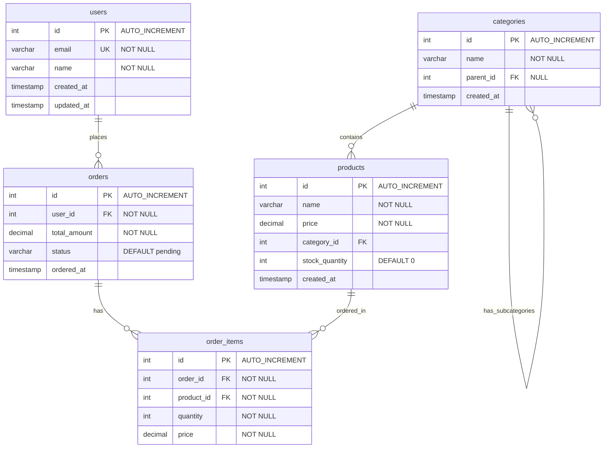

# Day 0: 環境構築

## 目標
- Docker環境でMySQLを構築
- サンプルデータベースと大量テストデータを準備
- Makeコマンドで簡単に環境管理

## プロジェクトディレクトリ構造
```
mysql-handson/
├── Makefile              # 環境管理用
├── docker-compose.yml    # MySQL設定
├── init/                 # 初期化スクリプト
│   ├── 01_schema.sql    # ECサイトスキーマ
│   └── 02_test_data.sql # 大量テストデータ
├── logs/                 # MySQLログ出力先
├── docs/                 # 研修資料
└── slides/              # プレゼンテーション
```

## テーブル構成



## Make環境構築手順

### 1. 使用可能なコマンド確認
```bash
make help
```

### 2. MySQL環境の構築
```bash
# MySQL環境を構築・起動
make setup
```

このコマンドで以下が自動実行されます：
- DockerでMySQL 8.0コンテナを起動
- データベース `training_db` を作成
- ECサイトのテーブル構造を構築
- 大量テストデータを生成（100万ユーザー、50万注文など）
- スロークエリログを有効化

### 3. MySQL接続
```bash
# 研修用ユーザーで接続
make connect

# 管理者として接続
make connect-root
```

### 4. 環境の状態確認
```bash
# コンテナ状態確認
make status

# MySQLログ確認
make logs

# スロークエリログ確認
make slow-logs
```

### 5. 環境停止・再起動
```bash
# 環境停止
make stop

# 環境再起動
make restart

# 完全削除（データも削除）
make clean
```

## データベース接続設定

- **データベース名**: `training_db`
- **研修用ユーザー**: `trainee` / パスワード: `traineepass`
- **管理者ユーザー**: `root` / パスワード: `rootpassword`
- **ポート**: `13306` (ホスト側)
- **外部接続**: `mysql -h localhost -P 13306 -u trainee -p training_db`

## 確認課題

### 1. 環境起動確認
```bash
# 環境構築
make setup

# 状態確認
make status
```

### 2. MySQL接続確認
```bash
# MySQL接続
make connect
```

### 3. テーブル構造とデータ確認
MySQL接続後、以下のクエリを実行：

```sql
-- データベース使用
USE training_db;

-- テーブル一覧表示
SHOW TABLES;

-- 各テーブルのレコード数確認
SELECT
    'users' AS table_name, COUNT(*) AS record_count FROM users
UNION ALL
SELECT 'categories', COUNT(*) FROM categories
UNION ALL
SELECT 'products', COUNT(*) FROM products
UNION ALL
SELECT 'orders', COUNT(*) FROM orders
UNION ALL
SELECT 'order_items', COUNT(*) FROM order_items;

-- テーブル構造確認
DESCRIBE users;
DESCRIBE orders;
```

### 4. スロークエリログ動作確認
```bash
# 別ターミナルでログ監視
make slow-logs
```

これで環境構築は完了です。Day 1からクエリチューニングの学習を開始しましょう！